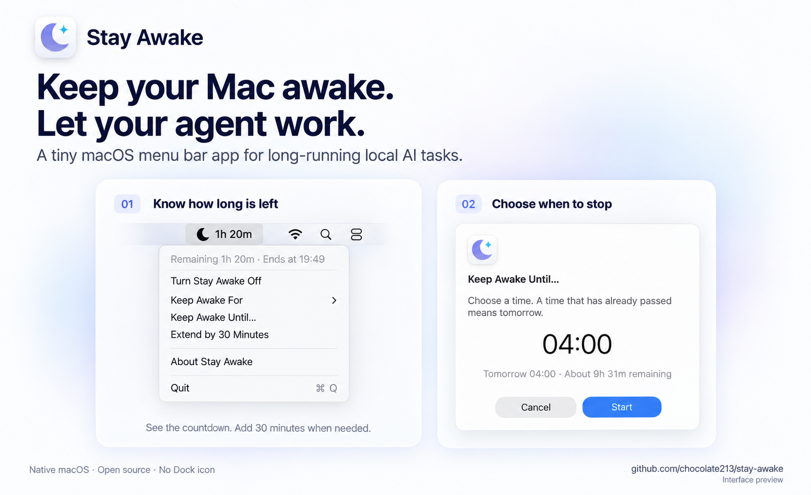

# Stay Awake

**Keep your Mac awake while local AI agents work.**

[Website](https://chocolate213.github.io/stay-awake/) · [Download](https://github.com/chocolate213/stay-awake/releases/latest)

A native macOS menu bar app powered by the system `caffeinate` command. Prevent idle sleep while your agent codes, tests, or builds, without changing system sleep settings.



*Interface illustration based on the app; appearance may vary by macOS version.*

## Features

- Presets: **15 or 30 minutes; 1, 2, 3, 4, 5, or 8 hours**, plus indefinite sessions.
- **Custom Duration**: hours and minutes, from 1 minute to 7 days, with immediate input validation.
- **Keep Awake Until**: choose a clock time; elapsed times mean tomorrow.
- Menu bar countdown, quick **30-minute extensions**, and mouse wheel / trackpad adjustment.
- English and Simplified Chinese. No Dock icon or expiry notifications.

## Install

Requires **macOS 11 or later**. Download the app zip from [GitHub Releases](https://github.com/chocolate213/stay-awake/releases/latest), unzip it, and move **Stay Awake.app** to Applications.

Open the app and look for the moon in the menu bar. Releases are ad-hoc signed, not notarized; if macOS blocks launch, use Finder's Open or System Settings → Privacy & Security to review and allow it.

## Usage

Click the moon, then choose **Keep Awake For**, **Keep Awake Until**, or **Turn Stay Awake On** for an indefinite session. The menu bar shows a countdown, `On`, or `Off`. Use **Extend by 30 Minutes** when needed; **Turn Stay Awake Off** or **Quit** releases the wake lock.

Scroll over a custom hours/minutes field to adjust it. For Keep Awake Until, select the time segment first, then scroll. Cancel preserves the current session.

Keep your MacBook's lid open. Stay Awake prevents idle sleep; it does not run agents or bypass their approvals or usage limits. It does not launch at login unless you add it to Login Items.

## For AI Agents

Requires macOS 11 or later. Use either installation path below. Install to `~/Applications/Stay Awake.app` without administrator privileges. Before replacing an existing installation, quit it through its menu; this stops its current wake session. If the user needs that session preserved, record and restore its remaining duration after relaunch.

### Install a GitHub release

Requires GitHub CLI (`gh`). Download the latest release and verify its checksum before installing:

```bash
set -e
download_dir="$(mktemp -d)"
gh release download --repo chocolate213/stay-awake \
  --pattern 'Stay-Awake-*-macOS.zip' \
  --pattern 'Stay-Awake-*-macOS.zip.sha256' \
  --dir "$download_dir"
(cd "$download_dir" && shasum -a 256 -c ./*.sha256)
ditto -x -k "$download_dir"/Stay-Awake-*-macOS.zip "$download_dir"
codesign --verify --deep --strict "$download_dir/Stay Awake.app"
mkdir -p "$HOME/Applications"
ditto "$download_dir/Stay Awake.app" "$HOME/Applications/Stay Awake.app"
open "$HOME/Applications/Stay Awake.app"
```

If the release binary is incompatible with the Mac's architecture, build from source. If Gatekeeper blocks launch, ask the user to review it in macOS; do not disable Gatekeeper or remove quarantine attributes.

### Install from source

Requires Git and Xcode Command Line Tools (`xcode-select --install` if missing); the full Xcode app is not required. Use a fresh directory, or use the user's existing checkout without discarding local changes.

```bash
set -e
git clone https://github.com/chocolate213/stay-awake.git
cd stay-awake
make verify
make run
```

`make run` builds for the current Mac, installs to `~/Applications`, and launches the app.

### Confirm installation

Check the installed version:

```bash
plutil -extract CFBundleShortVersionString raw -o - \
  "$HOME/Applications/Stay Awake.app/Contents/Info.plist"
```

Confirm the moon appears in the menu bar, start a short session, and stop it. On first launch, the app installs its bundled helper under `~/Library/Application Support/local.stay-awake.menu/`.

## Development

`make build` builds the app, `make verify` runs local checks, and `make release` creates a zip and checksum. See the [release checklist](docs/RELEASE.md).

For terminal workflows after the app has launched once, `scripts/stay-awake-toggle` toggles the shared session.

## Uninstall

Quit Stay Awake and delete the app. For a full cleanup, also remove `~/Library/Application Support/local.stay-awake.menu/`.
